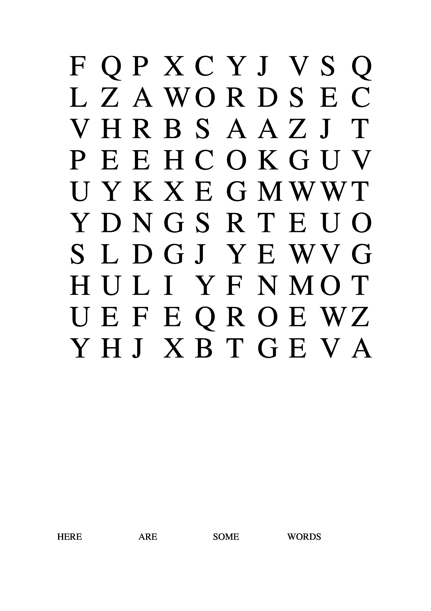
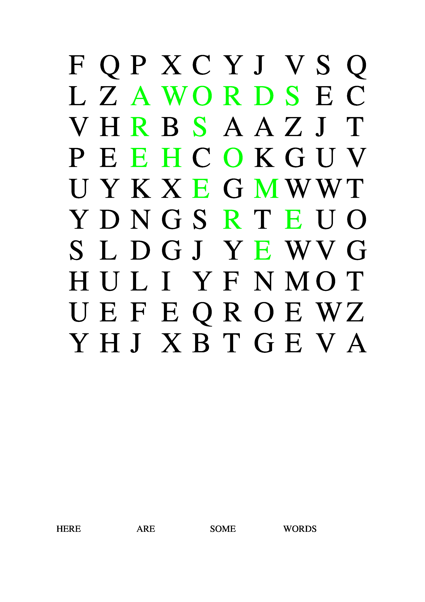

# Word Searches

---

- [Getting started.](#getting-started)
- [Creating your own word searches.](#creating-your-own-word-searches)
  - [Specification.](#specification)
  - [Solutions](#solutions)

---

Word searches is a cli for generating word searches.

Word Searches requires the jgraph plotting software to produce
word searches.

## Getting started.

Ensure you have the jgraph binary stored in your bin.

Then simply make sure you're in the root directory:

```
UNIX> ~/School/WordSearch$ pwd
/home/pooch/School/WordSearch
```

And then make the binary:

```
UNIX> ~/School/WordSearch$ make
g++ -std=c++11 -Iinclude -c -o obj/MakeSearch.o src/MakeSearch.cpp
g++ -std=c++11 -Iinclude -c -o obj/WordSearch.o src/WordSearch.cpp
g++ -std=c++11 -Iinclude -o bin/MakeSearch obj/MakeSearch.o obj/WordSearch.o
sh scripts/makeExamples.sh
```

After making the binary the makefile runs a bash script that produces a few
examples.

The example word searches are stored in the `/searches` directory as .jpg files.  
The solutions to those examples are stored in the `/solutions` directory as .jpg files.

---

## Creating your own word searches.

Word searches makes it easy to create your own word searches.

### Specification.

Word Searches takes words as strings on stdin to create the desired word search.
It emits the wordsearch as jgraph on standard output.

A size for the word search must be specified as a command-line arguement, signified with the -s flag.

Here's an example:

```
UNIX> ~/School/WordSearch$ pwd
/home/pooch/School/WordSearch
UNIX> ~/School/WordSearch$ make
g++ -std=c++11 -Iinclude -c -o obj/MakeSearch.o src/MakeSearch.cpp
g++ -std=c++11 -Iinclude -c -o obj/WordSearch.o src/WordSearch.cpp
g++ -std=c++11 -Iinclude -o bin/MakeSearch obj/MakeSearch.o obj/WordSearch.o
sh scripts/makeExamples.sh
UNIX> ~/School/WordSearch$ echo "Here" "are" "some"" words" | ./bin/MakeSearch -s 10 > example.jgr
```

...and here's the emitted jgraph:

```
UNIX> ~/School/WordSearch$ head example.jgr
newgraph
        y_translate 4.0
        xaxis nodraw min 0 max 10 size 6
        yaxis nodraw min 0 max 10 size 6
        newstring fontsize 40 hjl vjc x 0 y 10 : W
        newstring fontsize 40 hjl vjc x 0 y 9 : Z
        newstring fontsize 40 hjl vjc x 0 y 8 : N
        newstring fontsize 40 hjl vjc x 0 y 7 : R
        newstring fontsize 40 hjl vjc x 0 y 6 : L
        newstring fontsize 40 hjl vjc x 0 y 5 : O

```

### Solutions

A solution to the word search may be generated at the time of creation with the -a flag
The solution will be stored as jgraph in a file that is named whatever is assigned after the a flag.

Let's see an example of that:

```
UNIX> ~/School/WordSearch$ head exampleSolution.jgr
newgraph
        y_translate 4.0
        xaxis nodraw min 0 max 10 size 6
        yaxis nodraw min 0 max 10 size 6
        newstring fontsize 40 hjl vjc x 0 y 10 : S
        newstring fontsize 40 hjl vjc x 0 y 9 : I
        newstring fontsize 40 hjl vjc x 0 y 8 : Z
        newstring fontsize 40 hjl vjc x 0 y 7 : A
        newstring fontsize 40 hjl vjc x 0 y 6 lcolor 0 1 0 : H
        newstring fontsize 40 hjl vjc x 0 y 5 : T
```

We can then produce the images of them using jgraph like so:

```
UNIX> jgraph -P example.jgr | ps2pdf - | convert -density 300 - -quality 100 example.jpg
UNIX> jgraph -P exampleSolution.jgr | ps2pdf - | convert -density 300 - -quality 100 exampleSolution.jpg
```

Here's the images of our example Word Search and it's solution:



